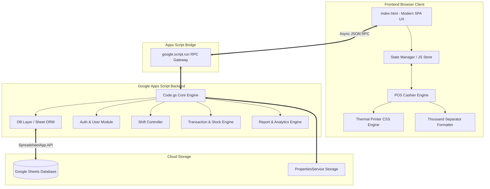
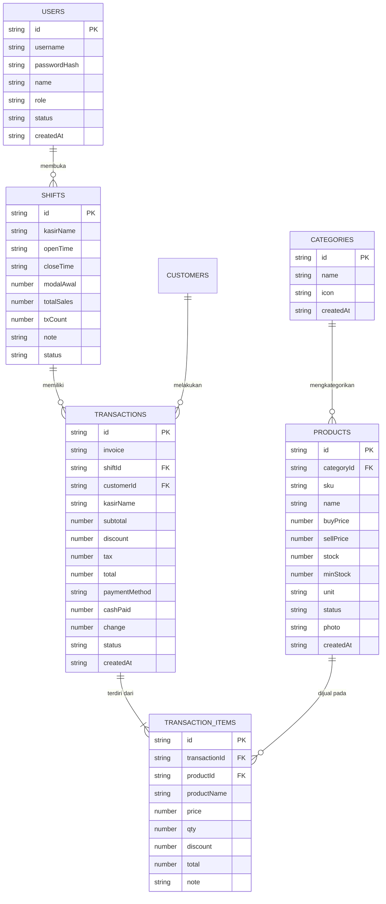

# 🏛️ Cetak Biru & Perancangan Arsitektur Sistem (System Architecture Design & Technical Blueprint)
## **Aplikasi Web Kasir POS Tempat Makan & Restoran (F&B Point-of-Sale)**

---

> **Catatan Architect**: Dokumen ini dirancang dari sudut pandang *Lead Systems Architect & Product Engineer* dalam merancang aplikasi web kasir *enterprise-grade* dari titik nol (*from scratch*). Semua aspek fungsional, non-fungsional, skema basis data, aliran data, komponen UI/UX, hingga arsitektur backend dijelaskan secara komprehensif.

---

## 1. 📋 Spesifikasi Kebutuhan Proyek (Business & Technical Requirements)

### 1.1 Visi Proyek
Membangun aplikasi kasir (*Point of Sale*) modern berbasis web (*Single Page Application*) yang cepat, responsif, tangguh, dan dapat diakses dari perangkat tablet, laptop, maupun *desktop*. Aplikasi ini secara khusus dioptimalkan untuk tempat makan/restoran (*Food & Beverage*) yang membutuhkan fleksibilitas pesanan, pencatatan shift kasir, manajemen stok bahan/menu, kalkulasi laba bersih, serta pencetakan struk thermal.

### 1.2 Kebutuhan Fungsional Utama (Functional Requirements)
1. **Otentikasi & Manajemen Pengguna**: Multi-role (Admin vs Kasir) dengan otorisasi hak akses terbatas.
2. **Manajemen Shift & Laci Uang Kasir (Cash Drawer Control)**: Pencatatan modal awal kasir (*cash float*), akumulasi penjualan selama shift, dan pertanggungjawaban uang fisik saat penutupan shift (*shift reconciliation*).
3. **Kasir POS & Manajemen Pesanan (Order Cart)**: Katalog menu visual berbasis grid dengan pencarian cepat, penyaringan kategori, variasi harga, serta pencatatan **catatan khusus dapur** per item (misal: *"Pedas sedang, tanpa daun bawang"*).
4. **UX Input Nominal Pemisah Ribuan (Live Thousand Separator)**: Pengalaman mengetik nominal harga/uang kembalian yang secara langsung memformat angka dengan pemisah titik tanpa merusak posisi kursor mengetik.
5. **Manajemen Stok & Soft-Delete ORM**: Pengurangan stok otomatis saat checkout, notifikasi stok kritis/hampir habis, dan mekanisme penghapusan produk secara *soft-delete* (menjaga performa tetap di bawah 100ms tanpa penataan ulang baris spreadsheet secara berulang).
6. **Pembayaran Multi-Metode & Calculator Kembalian**: Dukungan Tunai, QRIS, Kartu Debit, dan Kartu Kredit, lengkap dengan tombol cepat nominal pecahan uang pas (Rp 10k, 20k, 50k, 100k).
7. **Mesin Cetak Struk Belanja (Thermal Receipt Printer Engine)**: Pencetakan bukti transaksi ukuran 58mm/80mm secara langsung via browser tanpa dependensi software pihak ketiga.
8. **Analitik Penjualan & Laporan Laba Bersih**: Dashboard visual dengan grafik tren omset harian/bulanan, kalkulasi HPP (Harga Pokok Penjualan) vs Harga Jual, serta daftarmenu terlaris (*Top-selling Menu*).
9. **Pengaturan Identitas Toko & Struk**: Konfigurasi nama tempat makan, alamat, nomor telepon, logo, persentase pajak restoran (PB1/VAT), dan pesan *footer* struk.

### 1.3 Kebutuhan Non-Fungsional (Non-Functional Requirements)
- **Performa (Latency)**: Respon API backend $< 200\text{ ms}$ untuk operasi baca/tulis.
- **Ketersediaan & Arsitektur Serverless**: Berjalan tanpa server fisik (*zero server maintenance cost*) memanfaatkan Google Apps Script & Google Sheets.
- **Zona Waktu**: Sinkronisasi penuh zona waktu waktu lokal `Asia/Jakarta` (WIB) pada transaksi dan laporan.
- **Desain UI/UX Premium**: Menggunakan tema *Glassmorphism Dark/Vibrant System*, komponen visual interaktif, animasi mikro, dan tata letak *responsive dynamic*.

---

## 🏗️ 2. Arsitektur Sistem & Aliran Komunikasi Data

Aplikasi ini menggunakan pola arsitektur **Client-Side Rendered Single Page Application (SPA)** yang berkomunikasi secara terisolasi dengan **Serverless Backend API** melalui *Remote Procedure Call* (RPC).



---

## 🗄️ 3. Rancangan Skema Basis Data (Database ERD & Specifications)

Database terdiri dari **9 Sheet/Tabel** utama yang dihubungkan melalui *Primary Key* (UUID 16 Karakter) dan *Foreign Key*:



---

## 🧩 4. Rincian Pembuatan Modul demi Modul (Detailed Module Specifications)

---

### Modul 1: Inisialisasi Database & Layer ORM Backend (`Code.gs`)
- **Tujuan**: Menyediakan fungsi pemanggil data yang cepat, aman dari bentrokan tipe data, serta mampu melakukan auto-init jika spreadsheet belum ada.
- **Logika Teknis**:
  - `getSpreadsheet()`: Mengecek `PropertiesService` untuk ID spreadsheet. Jika belum ada, otomatis memicu `SpreadsheetApp.create('AplikasiKasir_Database')` dan menyimpannya.
  - `DB.getAll(sheetName)`: Mengambil baris spreadsheet, mencocokkan header sel baris 1 dengan nilai data sel berikutnya, dan mengembalikan Array of Objects JSON.
  - `DB.softDelete(sheetName, id)`: Menghindari instruksi `deleteRow()` yang lambat pada Apps Script dengan cara mengubah nilai sel `status` menjadi `'deleted'`.

---

### Modul 2: Modul Manajemen Shift & Control Laci Uang
- **Tujuan**: Menjamin akuntabilitas uang tunai yang dipegang kasir dari awal jam kerja hingga penutupan toko.
- **Logika Teknis**:
  1. Frontend secara periodik memanggil `getActiveShift(kasirName)`.
  2. Jika status shift bernilai `null` atau `'closed'`, aplikasi memblokir layar POS dan menampilkan modal **Buka Shift Baru**.
  3. Kasir mengisi `modalAwal` (diketik dengan format titik otomatis).
  4. ID shift yang aktif disisipkan pada setiap transaksi yang berhasil di-checkout.
  5. Saat **Tutup Shift**, sistem merekap total omset tunai vs non-tunai, menghitung total uang yang harus ada di laci, dan menyimpan `closeTime` serta status `'closed'`.

---

### Modul 3: Modul POS Kasir & Keranjang Pesanan Interaktif
- **Tujuan**: Menyediakan antarmuka pemilihan menu makanan/minuman yang sangat cepat dengan pencarian teks dan filter kategori.
- **Logika Teknis**:
  - Grid menu merender foto makanan, nama, kategori, harga jual, dan status stok.
  - Klik kartu menu mengoper item ke `state.cart`. Jika item sudah ada, kuantitas (`qty`) dinaikkan secara langsung.
  - Setiap item di keranjang memiliki input teks **Catatan Dapur** (`note`) yang tersimpan di memori lokal keranjang dan akan diteruskan ke item transaksi dan struk printer.
  - Kalkulasi Subtotal, Diskon, Pajak 10%, dan Grand Total diproses secara matematis tanpa mereload halaman.

---

### Modul 4: Engine Formatter Input Pemisah Ribuan (Live Thousand Separator)
- **Tujuan**: Memastikan input nominal harga produk, modal awal, dan pembayaran tunai terformat dengan pemisah titik (`.`) saat diketik tanpa mengganggu posisi kursor.
- **Logika Teknis**:
  ```javascript
  function formatPriceInput(input) {
    let cursorPosition = input.selectionStart;
    let originalLength = input.value.length;
    
    // Hapus karakter non-angka
    let cleanValue = input.value.replace(/\D/g, "");
    if (cleanValue === "") {
      input.value = "";
      return;
    }
    
    // Format pemisah titik tiap 3 digit
    let formatted = cleanValue.replace(/\B(?=(\d{3})+(?!\d))/g, ".");
    input.value = formatted;
    
    // Sesuaikan posisi kursor agar tidak melompat ke ujung kanan
    let newLength = formatted.length;
    cursorPosition = cursorPosition + (newLength - originalLength);
    input.setSelectionRange(cursorPosition, cursorPosition);
  }
  ```

---

### Modul 5: Modul Pembayaran & Kalkulator Uang Kembalian
- **Tujuan**: Memproses checkout transaksi dengan metode Tunai, QRIS, Debit, atau Kredit.
- **Logika Teknis**:
  - Menyediakan modal popup pembayaran dengan opsi nominal cepat: **Uang Pas**, **Rp 10.000**, **Rp 20.000**, **Rp 50.000**, **Rp 100.000**.
  - Menghitung uang kembalian secara otomatis:
    $$\text{Kembalian} = \text{Uang Diberikan} - \text{Total Tagihan}$$
  - Jika uang diberikan kurang dari total tagihan, tombol "Bayar" dikunci (*disabled*) dan peringatan warna merah ditampilkan.

---

### Modul 6: Engine Thermal Printing Struk Belanja (`@media print`)
- **Tujuan**: Mencetak struk transaksi fisik ukuran 58mm atau 80mm yang rapi dan profesional.
- **Logika Teknis**:
  - Menggunakan CSS terisolasi `@media print` yang menyembunyikan semua elemen navigasi UI web app (`display: none`) dan hanya menampilkan kontainer `#receipt-print-area`.
  - Struk mencantumkan Logo Toko, Nama Restoran, Alamat, No. Invoice, Nama Kasir, Tanggal & Waktu, Daftar Menu + Catatan Dapur, Subtotal, Pajak, Total, Pembayaran, Kembalian, dan Pesan *Footer*.

---

### Modul 7: Dashboard Analitik & Laporan Laba Bersih
- **Tujuan**: Memberikan insight bisnis keuangan tempat makan kepada pemilik/admin.
- **Logika Teknis**:
  - `getDashboardStats()` menghitung **Omset Penjualan Total**, **Jumlah Transaksi**, **Total Produk Active**, dan **Laba Bersih Realized**:
    $$\text{Laba Bersih} = \sum_{i=1}^{N} (\text{Harga Jual}_i - \text{Harga Beli}_i) \times \text{Qty}_i$$
  - Merender grafik batang & garis menggunakan **Chart.js** untuk tren pendapatan harian dan distribusi penjualan menu favorit.

---

## 🚀 5. Rencana Eksekusi Implementasi Bertahap (Implementation Roadmap)

1. **Fase 1 - Core Backend & Database Framework**: Menyusun file `Code.gs`, skema sheet, dan ORM helper.
2. **Fase 2 - Design System & App Shell**: Membuat `Index.html` dengan CSS Variables, Glassmorphism UI, dan struktur layout responsive.
3. **Fase 3 - Modul Produk & Management Shift**: Membangun UI CRUD Produk, upload foto, dan modal Shift Kasir.
4. **Fase 4 - POS Checkout & Thermal Printing**: Membangun grid catalog, keranjang pesanan, modal bayar, format ribuan live, dan mesin cetak struk CSS `@media print`.
5. **Fase 5 - Laporan & Analytics**: Integrasi Chart.js dan kalkulasi laba rugi.
6. **Fase 6 - Verification & Deployment**: Menjalankan pengujian akhir dan mendeploy ke Google Apps Script Web Application.

---
